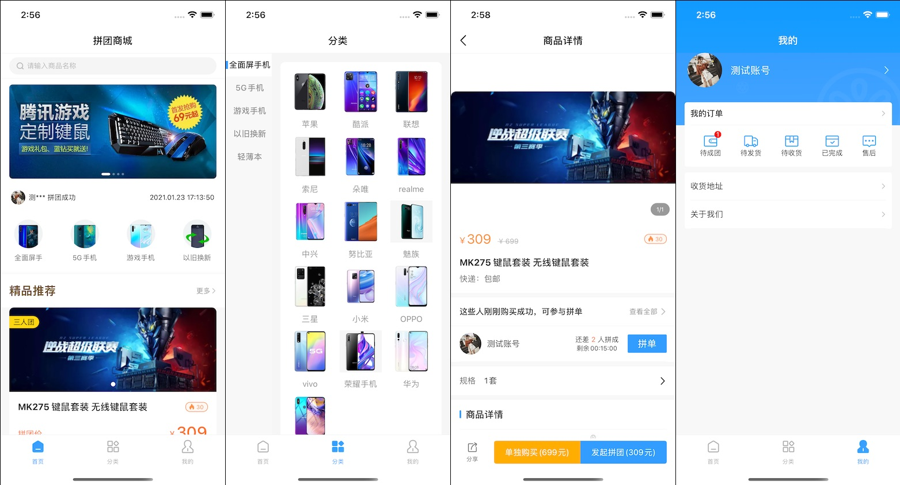

# 拼团商城项目源码解析

> 此项目为拼团商城类型，主要功能包括商品分类、商品详情、商品搜索、拼团、订单管理等。
> 
> 项目源码在 https://github.com/apicloudcom/group-ec 仓库的 widget 目录下。
> 
> 如果觉得对您有帮助，希望给个 star 鼓励一下。

项目中前端采用 [avm 多端开发技术](https://docs.apicloud.com/apicloud3?uzchannel=30)进行开发，要点包括 TabLayout 布局、swiper 轮播图、rich-text 富文本、scroll-view 滚动视图、下拉刷新、组件封装等。使用 APICloud 多端技术进行开发，实现一套代码多端运行，支持编译成 Android & iOS App 以及微信小程序。

项目后端则是使用的 [APICloud 数据云 3.0](https://docs.apicloud.com/Cloud-API/sentosa?uzchannel=30) 自定义云函数来构建的。



### 使用步骤

1. 使用 [APICloud Studio 3](https://www.apicloud.com/studio3?uzchannel=30) 作为开发工具。
2. 下载本项目源码。
3. 在开发工具中新建项目，并将本源码导入新建的项目中，注意更新 config.xml 中的 appid 为你项目的 appid。
4. 使用 AppLoader 进行真机同步调试预览。
5. 或者提交项目源码，并为当前项目云编译自定义 Loader 进行真机同步调试预览。
6. [云编译](https://www.apicloud.com/appoverview?uzchannel=30) 生成 Android & iOS App 以及微信小程序源码包。

如果之前未接触过 APICloud 开发，建议先了解一个简单项目的初始化、预览、调试和打包等操作，请参考 [APICloud 多端开发快速上手教程](https://github.com/apicloudcom/hello-app/blob/main/README.md)。

## 网络请求接口封装

在 script/util.js 中，封装了统一的网络请求接口 ajax 方法，对整个项目的请求进行统一管理，包括处理传入参数、拼装完整请求 url、设置请求头等，最后调用 api.ajax 方法发起请求，在请求的回调方法里面还对 cookie 是否过期做了全局判断，过期后会清除本地用户登录信息，并提示重新登录。

```js
// util.js
ajax(p, callback) {
   var param = p;
   if (!param.headers) {
       param.headers = {};
   }
   param.headers['X-AppToken'] = UserCenter.getAccessToken();
   if (param.data && param.data.body) {
       param.headers['Content-Type'] = 'application/json; charset=utf-8';
   }
   if (param.url) {
       var baseUrl = 'https://a6047344573226-dev.apicloud-saas.com/api/';
       param.url = baseUrl + param.url;
   }
   api.ajax(param, (res, err)=> {
       let ret = res;
       if (err && err.body && err.body.errCode) {
           ret = err.body;
           callback(ret);
       } else {
           callback(ret, err);
       }
       let sessionExpiration = false;
       if (ret && ret.errCode && ret.errCode>100) {
           sessionExpiration = true;
       }
       if (sessionExpiration) {
           var didShowLogoutAlert = api.getGlobalData({
               key: 'didShowLogoutAlert'
           });
           if (!didShowLogoutAlert) {
               api.setGlobalData({
                   key: 'didShowLogoutAlert',
                   value: true
               });

               UserCenter.setUserInfo('');
               api.confirm({
                   msg: '登录已失效，请重新登录',
                   buttons: ['取消', '重新登录']
               }, (ret)=> {
                   api.setGlobalData({
                       key: 'didShowLogoutAlert',
                       value: false
                   });
                   if (ret.buttonIndex == 2) {
                       this.goLogin();
                   }
               });
           }
       }
   });
}
```

## 用户登录信息管理

在 script/user.js 中，对用户登录信息进行了封装，做了统一管理，可以方便地判断是否登录、保存和获取用户信息、以及判断登录是否过期的 accessToken 等。

```js
const UserCenter = {
    isLogin(){
        let access_token = this.getAccessToken();
        return access_token?true:false;
    },
    setUserInfo(userInfo){
        delete userInfo.addtime;
        api.setPrefs({
            key: 'userInfo',
            value: userInfo
        });
        api.setPrefs({
            key: 'access_token',
            value: userInfo.access_token?userInfo.access_token:''
        });
    },
    getUserInfo(){
        let userInfo = api.getPrefs({
            sync: true,
            key: 'userInfo'
        });
        return userInfo?JSON.parse(userInfo):'';
    },
    getAccessToken(){
        return api.getPrefs({
            sync: true,
            key: 'access_token'
        });
    }
};

export default UserCenter;
```

## TabBar 和导航栏的实现

首页使用了 TabLayout 布局来实现 TabBar 和导航栏，在 config.xml 里面配置 content 字段，值为 json 文件路径，在 json 文件中配置 TabBar、导航栏和页面信息。

```xml
// config.xml
<content src="config.json" />
```

config.json 文件内容如下，设置了 navigationBar 的背景色和标题文字颜色，设置了 tabBar 每项的 icon 和文字，以及每项对应的页面。

```js
{
  "name": "root",
  "hideNavigationBar": false,
  "navigationBar": {
    "background": "#fff",
    "color": "#000",
    "shadow": "#f1f1f1",
    "hideBackButton": true
  },
  "tabBar": {
    "scrollEnabled": false,
    "background": "#fff",
    "shadow": "#f1f1f1",
    "color": "#aaa",
    "selectedColor": "#339DFF",
    "preload": 0,
    "frames": [{
      "name": "page1",
      "url": "pages/main1/main1.stml",
      "title": "拼团商城"
    }, {
      "name": "page2",
      "url": "pages/main2/main2.stml",
      "title": "分类"
    }, {
      "name": "page4",
      "url": "pages/main4/main4.stml",
      "title": "我的"
    }],
    "list": [{
      "text": "首页",
      "iconPath": "images/common/main1_1.png",
      "selectedIconPath": "images/common/main1.png"
    }, {
      "text": "分类",
      "iconPath": "images/common/main2_1.png",
      "selectedIconPath": "images/common/main2.png"
    }, {
      "text": "我的",
      "iconPath": "images/common/main4_1.png",
      "selectedIconPath": "images/common/main4.png"
    }]
  }
}
```

这里”我的“页面隐藏了导航栏，而其它页面没有隐藏。”我的“页面路径为 pages/main4/main4.stml，我们参照微信小程序的语法，在同目录下放置了 main4.json 文件，在里面配置 navigationStyle 字段为 custom。

```js
{
  "navigationStyle":"custom"
}
```

在首页 main1.stml 的 apiready 方法里面则监听了 tabBar 每项的点击事件，在 App 端，我们需要在点击事件里面动态设置页面显示、隐藏导航栏。

```js
// index.stml
api.addEventListener({
	name:'tabitembtn'
}, function(ret){
	var hideNavigationBar = ret.index == 2;
	api.setTabLayoutAttr({
		hideNavigationBar: hideNavigationBar,
		animated: false
	});
	api.setTabBarAttr({
		index: ret.index
	});
});
```

## 轮播图实现

首页和商品详情页面都使用了轮播图，这里以首页为例，首页路径为 pages/main1/main1.stml，里面轮播图使用 swiper 组件实现，使用 v-for 指令循环 swiper-item，bannersList 为定义的数组类型的属性。这里监听了图片的 click 事件，点击后需要跳转到对应的详情页面。这里使用了自定义的指示器，通过设置指示器容器的 position 定位属性为 absolute，来让指示器显示到当前轮播图的上面。

```html
<view class="banner_box" style={'height:'+swiperHeight+'px;'}>
	<swiper class="banner_swiper" circular autoplay11 onchange="fnSwiperChange">
		<swiper-item v-for="(item_, index_) in bannerList">
			<image class="banner_img" src={item_.icon} mode="aspectFill" onclick="fnBannerPage" data-index={index_}></image>
		</swiper-item>
	</swiper>
	<view class="banner_dots">
		<view v-for="(item, index) in bannerList" class={current == index ? 'banner_dot-on' : 'banner_dot'}></view>
	</view>
</view>
```

为保持不同分辨率设备上面图片显示比例不变，需要让轮播图的宽度跟随屏幕宽度变化，高度则通过计算属性 swiperHeight 来动态计算得到。

```js
computed:{
	swiperHeight(){
		return Math.floor((api.winWidth - 30)*0.4+20);
	}
}
```

## rich-text 富文本的使用

在商品详情页中，商品详情部分就是使用的 rich-text 来展示的，使用时如果没为 rich-text 设置高度，其高度就为里面内容的高度。

```js
<rich-text nodes={html}></rich-text>
```

rich-text 用于展示 HTML String 片段，在从服务器获取到 HTML String 后，我们调用 $util.fitRichText 方法处理了一下 HTML String，在 fitRichText 方法中为 img 标签加了最大宽度的限制，以防止图片宽度过大导致显示溢出。

```js
// util.js
fitRichText(richtext, width){
   var str = `
	<list-item v-for="(item) in goodsList" item={item} showOriginalPrice onitemClick="fnOpenDetails"></list-item>
	<no-data v-if={showNoData} image="../../images/common/nolist.png" desc="暂无商品"></no-data>
</scroll-view>
```

下拉刷新使用了 scroll-view 默认的下拉刷新样式，使用 refresher-enabled 字段来开启下拉刷新，为 refresher-triggered 字段绑定了 refresherTriggered 属性来控制下拉刷新状态，需要注意的是，在刷新的事件回调方法里面，我们需要主动设置 refresherTriggered 的值为 true，在数据加载完成后再设置为 false，这样绑定的值有变化，刷新状态才能通知到原生里面。

```js
onrefresherrefresh(){
	this.data.refresherTriggered = true;
	this.getData(false);
}
```

滚动到底部监听了 scroll-view 的 scrolltolower 事件，在滚动到底部后自动加载更多数据，加载更多和下拉刷新都是调用 loadData 方法请求数据，通过 loadMore 参数来进行区分，做分页请求处理。

```js
getData(loadMore){
	let that = this;
	if (!loadMore) {
		that.data.page = 1;
	}
	this.data.loading = true;
	var url = "homes/getGoodsList?classid=" + that.data.classId + "&page=" + that.data.page;
	$util.ajax({
		url: url
	}, function(res, err){
		if (res && res.errcode == 0) {
			let list = res.data;
			that.data.haveMore = list.length > 0;
			if (loadMore) {
				that.data.goodsList = that.data.goodsList.concat(list);
			} else {
				that.data.goodsList = list;
			}
			if (list.length > 0) {
				that.data.page += 1;
			}
		}
		that.data.loading = false;
		that.data.refresherTriggered = false;
		that.data.showNoData = that.data.goodsList.length == 0;
		$util.hideProgress();
	});
}
```

## 自定义三级联动城市选择器组件

在填写收货地址页面（pages/address_edit/address_edit.stml）里面有一需求，为选择收货地址城市区域，为此我们在 picker 组件的基础上封装了一个 region-picker 组件（components/region-picker.stml），使用时监听该组件的 change 事件，就可以获取到选择的城市区域的名称和城市代码。

```js
// address_edit.stml

<region-picker region={qustr||''} onchange="fnChooseStr"></region-picker>

fnChooseStr(e){
	let code = e.detail.code;
	let val = e.detail.value;
	this.data.quid = code.join(",");
	this.data.qustr = val.join(",");

}
```

## 平台差异化处理

在多端开发中，难免会遇到不同平台差异化的地方，需要在运行期间做判断处理，为此在 utils/util.js 中封装了 isApp、isMp 方法，里面通过 api.platform 属性判断当前运行环境是 App 端还是小程序端。

```js
// util.js
isApp(){
   if (api.platform && api.platform == 'app') {
       return true;
   }
   return false;
},
isMp(){
   if (api.platform && api.platform == 'mp') {
       return true;
   }
   return false;
}
```
